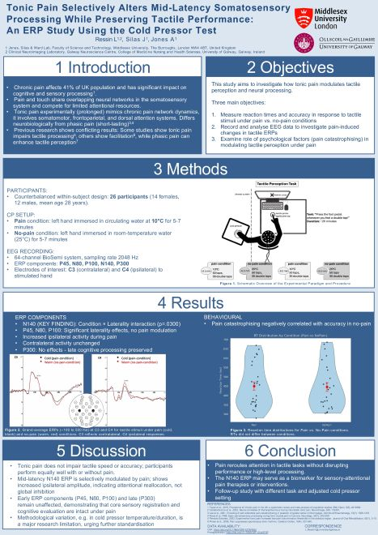
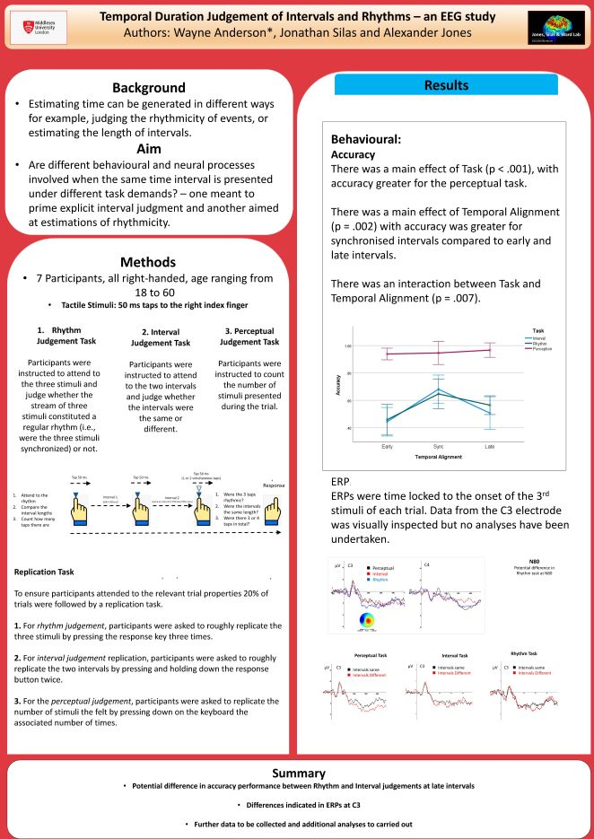
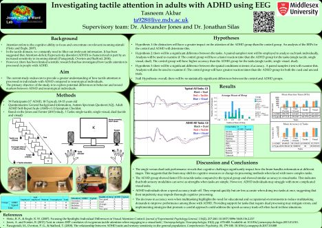
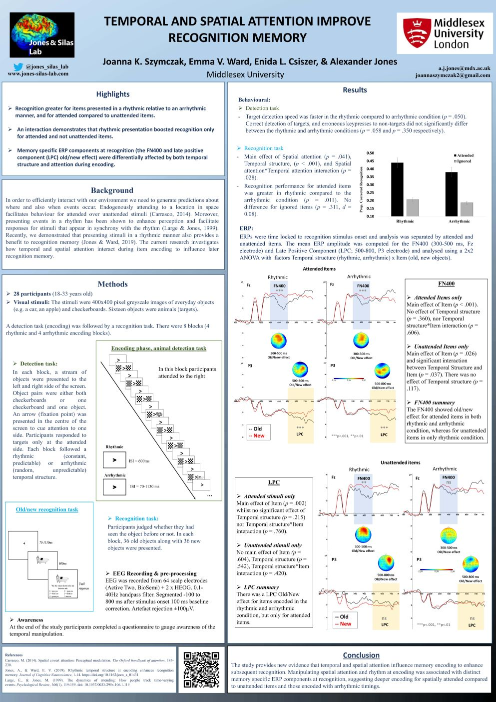
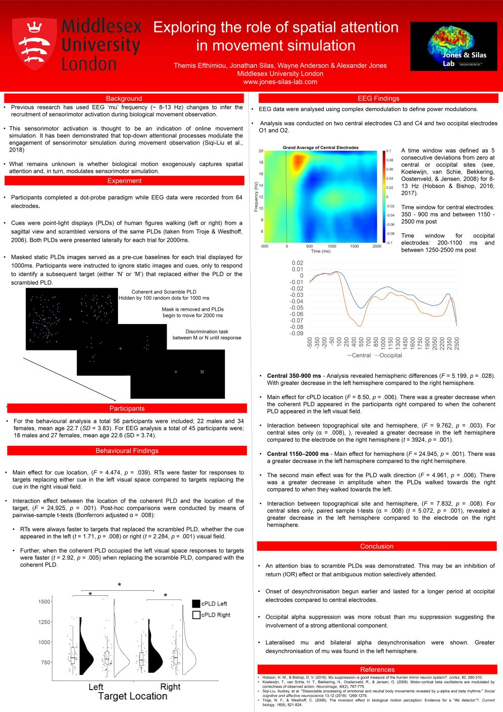

## Talks
Click link to download pdf of slides.

[Jon's talk at EMF 2026 - Stimulating Brains Without Touching Them.](talks/EMF2026.pdf)
You can also watch a recording of the talk [here](Videos.qmd#talks)

[Jon & Alex's talk at BACN - 2023 Spatial attention not affected by tACS: a registered report](talks/BACN23.pdf)

[Jon & Alex's talk to the University of the Third Age - 2022](talks/U3A2022.pdf) 

[Jon & Alex's second year lecture on EEG - 2022](talks/EEGandID2022.pdf) 

## Posters 
Click the image to download a pdf of the poster.

:::{layout=[30,-5,30,-5,30] layout-valign="top"}

{target="_blank"}

{target="_blank"}

{target="_blank"}

{target="_blank"}

{target="_blank"}

{target="_blank"}

{target="_blank"}

{target="_blank"}

{target="_blank"}

{target="_blank"}
::: 
